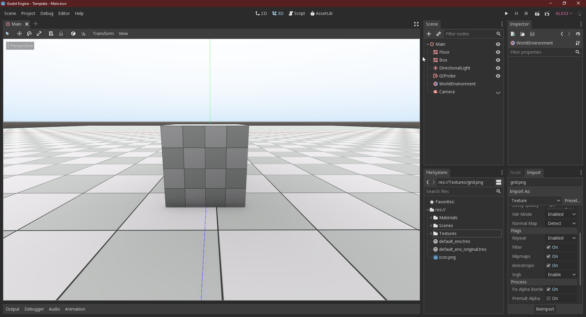

# Blank Starter Template (3D)

This template aims to gives a basic starter project with some predefined settings to achieve an high quality look

For Godot 3.1 and above

### Project Settings:

- MSAA enabled
- SSAO(GI) Enabled
- Bluish skybox changed to more neutral color
- Grid texture imported with Anisotropic flag to avoid blurriness
- Default directional light pointing down for uniform lighting
- GIProbe to improve quality

### Extras:

- .gitignore for version control
- Basic WASD camera navigation
- editor_layout.cfg, to reproduce the same layout as in the screenshot, this needs to be copy into `%APPDATA%/Godot/projects/`**REPLACE_WITH_YOUR_PROJECT**