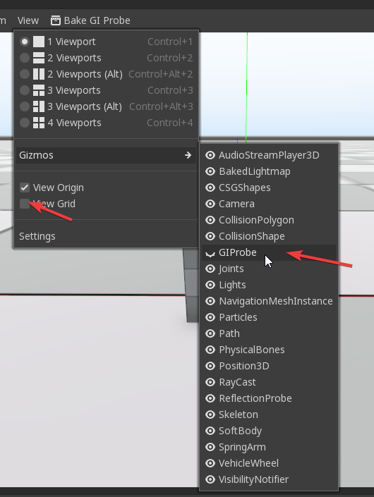

# Blank Starter Template (3D)

This template aims to gives a basic starter project with some predefined settings to achieve an high quality look

For Godot 3.1 and above

```diff
- Warning: this template is meant to be used for hight quality look, a high end pc is required, this might not work well in a low spec machine or integrated graphics card
```


### Project Settings:

- GLES3 Renderer
- MSAA enabled
- SSAO Enabled
    - https://docs.godotengine.org/en/3.1/tutorials/3d/environment_and_post_processing.html#screen-space-ambient-occlusion-ssao
- SSR Enabled
    - https://docs.godotengine.org/en/3.1/tutorials/3d/environment_and_post_processing.html#screen-space-reflections-ssr
- Bluish skybox changed to more neutral color
- Grid texture imported with Anisotropic flag to avoid blurriness
- Default directional light pointing down for uniform lighting

### Extras:

- .gitignore for version control
- Basic WASD camera navigation
- editor_layout.cfg, to reproduce the same layout as in the screenshot, this needs to be copy into `%APPDATA%/Godot/projects/`**REPLACE_WITH_YOUR_PROJECT**

### Tips:

1. Use GIProbe to improve quality 
    - https://docs.godotengine.org/en/3.1/tutorials/3d/gi_probes.html#gi-probes
    - SSAO looks best when combined with a real source of indirect light, like GIProbe:
    - tweet from Godot Engine Lead Developer: https://twitter.com/reduzio/status/922132171850158081    
    - Performance requirements are higher than for lightmaps, so it may not run properly in low-end integrated GPUs (may need to reduce resolution)
    - GIProbes are quite demanding. It is possible to use lower quality voxel cone tracing in exchange for more performance.

2. Disable **View Grid** and **GIProbe** from the viewport options, this will hide the giprobe green box, and the grid is not needed since we have a floor mesh with grid texture (but you might need enable it for snapping)
    

3. Adjust the **Grid** material UV1 to fit better the grid, set always half of the mesh side , 
    - ex: Mesh Size X : 128  , Grid UV1 X: 64

4. MSSA, SSAO, SSR are set at medium quality, this can be increase for better quality, or reduce for perfomance

5. You might need to diabled SSR from the enviroment settings to increased the performance if you enviroment doesnt has too much reflections

6. Remove the **docs** folder from your project and change the README.md

7. Activate Fallback to GLES2 to support older hardware but keep in mind this will change the look of the scene
